# Inject Produksi ERD

Dokumentasi ini menjelaskan model data utama untuk modul `Inject Produksi`, dengan fokus pada:

- tabel header produksi
- tabel operator produksi
- tabel input produksi
- tabel output produksi

## Ruang Lingkup

Entitas pusat pada modul ini adalah `InjectProduksi_h` dengan relasi ke:

- `InjectProduksiOperator_d` sebagai detail operator
- tabel `InjectProduksiInput...` sebagai sumber input produksi
- tabel `InjectProduksiOutput...` sebagai hasil output produksi

## ERD Final

```mermaid
erDiagram
    InjectProduksi_h ||--o{ InjectProduksiOperator_d : has_operator

    InjectProduksi_h ||--o{ InjectProduksiInputBroker : input_broker
    InjectProduksi_h ||--o{ InjectProduksiInputBrokerPartial : input_broker_partial
    InjectProduksi_h ||--o{ InjectProduksiInputMixer : input_mixer
    InjectProduksi_h ||--o{ InjectProduksiInputMixerPartial : input_mixer_partial
    InjectProduksi_h ||--o{ InjectProduksiInputGilingan : input_gilingan
    InjectProduksi_h ||--o{ InjectProduksiInputGilinganPartial : input_gilingan_partial
    InjectProduksi_h ||--o{ InjectProduksiInputFurnitureWIP : input_furniture_wip
    InjectProduksi_h ||--o{ InjectProduksiInputFurnitureWIPPartial : input_furniture_wip_partial
    InjectProduksi_h ||--o{ InjectProduksiInputCabinetMaterial : input_cabinet_material
    InjectProduksi_h ||--o{ InjectProduksiInputCabinetWIP : input_cabinet_wip

    InjectProduksi_h ||--o{ InjectProduksiOutputBonggolan : output_bonggolan
    InjectProduksi_h ||--o{ InjectProduksiOutputMixer : output_mixer
    InjectProduksi_h ||--o{ InjectProduksiOutputRejectV2 : output_reject
    InjectProduksi_h ||--o{ InjectProduksiOutputFurnitureWIP : output_furniture_wip
    InjectProduksi_h ||--o{ InjectProduksiOutputBarangJadi : output_barang_jadi

    InjectProduksiInputBroker }o--|| Broker_d : source
    InjectProduksiInputBrokerPartial }o--|| BrokerPartial : source
    InjectProduksiInputMixer }o--|| Mixer_d : source
    InjectProduksiInputMixerPartial }o--|| MixerPartial : source
    InjectProduksiInputGilingan }o--|| Gilingan : source
    InjectProduksiInputGilinganPartial }o--|| GilinganPartial : source
    InjectProduksiInputFurnitureWIP }o--|| FurnitureWIP : source
    InjectProduksiInputFurnitureWIPPartial }o--|| FurnitureWIPPartial : source
    InjectProduksiInputCabinetMaterial }o--|| MstCabinetMaterial : source
    InjectProduksiInputCabinetWIP }o--|| MstCabinetWIP : source

    InjectProduksiOutputBonggolan }o--|| Bonggolan : result
    InjectProduksiOutputMixer }o--|| Mixer_d : result
    InjectProduksiOutputRejectV2 }o--|| RejectV2 : result
    InjectProduksiOutputFurnitureWIP }o--|| FurnitureWIP : result
    InjectProduksiOutputBarangJadi }o--|| BarangJadi_h : result

    InjectProduksi_h {
        string NoProduksi PK
        date TglProduksi
        int IdMesin
        int IdRegu
        int Shift
        int IdCetakan
        int IdWarna
        int IdFurnitureMaterial
        time HourStart
        time HourEnd
        decimal BeratProdukHasilTimbang
        bit IsComplete
    }

    InjectProduksiOperator_d {
        int Id PK
        string NoProduksi FK
        int IdOperator FK
        datetime CreatedAt
    }

    InjectProduksiInputBroker {
        string NoProduksi FK
        string NoBroker FK
        int NoSak
    }

    InjectProduksiInputBrokerPartial {
        string NoProduksi FK
        string NoBrokerPartial FK
    }

    InjectProduksiInputMixer {
        string NoProduksi FK
        string NoMixer FK
        int NoSak
    }

    InjectProduksiInputMixerPartial {
        string NoProduksi FK
        string NoMixerPartial FK
    }

    InjectProduksiInputGilingan {
        string NoProduksi FK
        string NoGilingan FK
    }

    InjectProduksiInputGilinganPartial {
        string NoProduksi FK
        string NoGilinganPartial FK
    }

    InjectProduksiInputFurnitureWIP {
        string NoProduksi FK
        string NoFurnitureWIP FK
    }

    InjectProduksiInputFurnitureWIPPartial {
        string NoProduksi FK
        string NoFurnitureWIPPartial FK
    }

    InjectProduksiInputCabinetMaterial {
        string NoProduksi FK
        int IdCabinetMaterial FK
        int Pcs
        decimal Berat
    }

    InjectProduksiInputCabinetWIP {
        string NoProduksi FK
        int IdCabinetWIP FK
        int Pcs
        decimal Berat
    }

    InjectProduksiOutputBonggolan {
        string NoProduksi FK
        string NoBonggolan FK
    }

    InjectProduksiOutputMixer {
        string NoProduksi FK
        string NoMixer FK
        int NoSak
    }

    InjectProduksiOutputRejectV2 {
        string NoProduksi FK
        string NoReject FK
    }

    InjectProduksiOutputFurnitureWIP {
        string NoProduksi FK
        string NoFurnitureWIP FK
    }

    InjectProduksiOutputBarangJadi {
        string NoProduksi FK
        string NoBJ FK
    }

    Broker_d {
        string NoBroker PK
        int NoSak PK
    }

    BrokerPartial {
        string NoBrokerPartial PK
    }

    Mixer_d {
        string NoMixer PK
        int NoSak PK
    }

    MixerPartial {
        string NoMixerPartial PK
    }

    Gilingan {
        string NoGilingan PK
    }

    GilinganPartial {
        string NoGilinganPartial PK
    }

    FurnitureWIP {
        string NoFurnitureWIP PK
    }

    FurnitureWIPPartial {
        string NoFurnitureWIPPartial PK
    }

    MstCabinetMaterial {
        int IdCabinetMaterial PK
    }

    MstCabinetWIP {
        int IdCabinetWIP PK
    }

    Bonggolan {
        string NoBonggolan PK
    }

    RejectV2 {
        string NoReject PK
    }

    BarangJadi_h {
        string NoBJ PK
    }
```

## Catatan

- `InjectProduksi_h` adalah header utama transaksi produksi inject.
- `InjectProduksiOperator_d` menyimpan relasi operator terhadap `NoProduksi`.
- Tabel `InjectProduksiInput...` menyimpan seluruh input yang dipakai produksi.
- Tabel `InjectProduksiOutput...` menyimpan seluruh hasil output produksi.
- Diagram ini fokus pada relasi data utama untuk dokumentasi teknis modul inject produksi.
